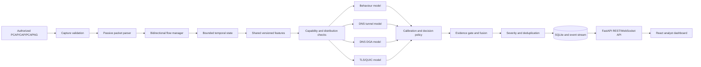

# Custodian

> A local-first, passive and evidence-aware network threat detection MVP.

Custodian reads an authorized packet capture, reconstructs bidirectional network flows, extracts observable metadata, evaluates four trained detector families, applies capability and evidence gates, and presents the results in an analyst dashboard.

The application is designed for a one-laptop demonstration. It does **not** transmit captured packets, actively scan hosts, inject traffic, block connections, execute captured content, or decrypt TLS/QUIC payloads. “Replay” means replaying recorded observations through the local analysis pipeline—not replaying packets onto a network.

## Project status

Custodian currently provides a complete passive-PCAP MVP with four hash-verified model packages:

| Detector | Artifact | Runtime state | Supported MVP output |
|---|---|:---:|---|
| Behaviour | XGBoost multiclass classifier | Integrated | `BENIGN`, `DDOS`, `RECON`, `BOT_OR_C2_LIKE` |
| DNS tunnelling | HistGradientBoosting classifier | Integrated | `BENIGN_DNS`, `DNS_TUNNEL` |
| DNS DGA | HistGradientBoosting classifier | Integrated | `BENIGN`, `DGA` |
| TLS/QUIC metadata | HistGradientBoosting classifier | Integrated | `BENIGN_ENCRYPTED`, `MALICIOUS_ENCRYPTED_SESSION` |

All four packages are enabled by the repository-safe local demonstration configuration in `configs/models.demo.yaml`. They are real trained estimators—not frontend rules—but they remain **MVP candidates**, not production-certified security controls.

The latest external checks show mixed generalisation. In particular, the Behaviour model collapsed to benign predictions on CIC-UNSW-NB15. See [External model validation](docs/EXTERNAL_MODEL_VALIDATION.md) before making accuracy or coverage claims.

## What Custodian demonstrates

- Safe discovery and validation of `.cap`, `.pcap`, and `.pcapng` files confined to `data/demo/`.
- Incremental, read-only parsing of Ethernet, Linux cooked and raw-IP captures.
- IPv4/IPv6 TCP, UDP and ICMP observation.
- Observable DNS, TLS and QUIC metadata parsing without payload decryption.
- Bidirectional flow reconstruction with explicit initiator direction and close reasons.
- Bounded temporal windows for host and flow behaviour.
- Shared, versioned feature extraction used by training and runtime.
- Four trained detector families with schema, class and hash validation.
- Explicit capability checks, evidence sufficiency and unknown/insufficient-evidence handling.
- Severity scoring, alert deduplication and acknowledge/close lifecycle.
- Replay start, pause, resume, stop, reset, speed control and forward/backward seeking.
- Local SQLite persistence, bounded retention and JSON/CSV exports.
- REST and WebSocket APIs with interactive OpenAPI documentation.
- A responsive React dashboard for monitoring, investigation, traffic, detector readiness and measured performance.

## Architecture



### Runtime decision flow

1. The capture validator resolves the requested file beneath `data/demo/`, rejects path/symlink escapes, enforces a size limit, checks the extension and validates the capture format.
2. The parser reads frames incrementally and emits metadata observations. Captured payloads are not executed and encrypted application data is not decrypted.
3. The flow manager combines both directions of a conversation and closes flows on FIN, RST, timeout, capture end or bounded-state eviction.
4. Temporal state builds rolling 10, 60 and 300-second views while enforcing configured memory bounds.
5. Shared feature extractors create versioned vectors for Behaviour, DNS and TLS/QUIC detectors.
6. Observation and compatibility gates verify that the necessary metadata exists and matches the loaded artifact schema.
7. The approved model package performs inference and probability calibration using its recorded decision policy.
8. The evidence gate checks whether the passive observation actually supports the predicted class.
9. Accepted decisions become Pydantic-validated alerts with confidence, evidence, limitations and provenance. Repeated findings are deduplicated rather than silently multiplied.
10. SQLite, REST endpoints and WebSocket events expose the same backend records to the dashboard.

This separation lets a later authorized passive live-capture adapter emit the same packet-observation contract without redesigning the downstream pipeline. Live-interface capture is not currently activated.

## Core design principles

### Passive by construction

There is no packet-transmission return path in the replay runtime. Custodian observes locally stored traffic and never sends those frames to their recorded destinations.

### Evidence before alerts

A high model probability alone is insufficient. Each threat class declares required capabilities, evidence fields and minimum observations in `configs/evidence.yaml`. Missing context remains visible rather than being fabricated.

### Training/runtime feature parity

Training adapters and runtime detectors use shared feature modules under `src/custodian/features/`. Artifact schemas include family and version identifiers, and incompatible packages fail closed.

### Honest degradation

Detector families report their own readiness. A missing or invalid artifact does not silently become a hard-coded detection rule. The dashboard displays partial readiness and unavailable stages.

### Bounded local operation

Active flows, temporal events, retained alerts, database size and capture size are bounded through configuration. This keeps the MVP predictable on one laptop.

## Technology stack

| Layer | Technology | Role |
|---|---|---|
| Language/runtime | Python 3.11+ | Ingestion, flow processing, models, API and CLI |
| API | FastAPI + Uvicorn | Local REST, WebSocket and OpenAPI service |
| Contracts | Pydantic | Validated configuration and runtime records |
| Packet parsing | `dpkt` | Passive capture decoding |
| Data/feature work | NumPy, pandas, PyArrow | Vectorised preparation and feature conversion |
| ML | scikit-learn, XGBoost, joblib | Training, calibration, serialization and inference |
| Persistence | SQLite | Local users, alerts, events, flows and checkpoints |
| Authentication | Argon2id + JWT | Local MVP accounts and session tokens |
| Runtime telemetry | psutil + internal metrics | CPU, memory, throughput and latency measurement |
| Frontend | React + TypeScript | Analyst-facing application |
| Build/dev server | Vite | Frontend development and production build |
| Configuration | YAML + environment variables | Runtime, models, evidence, replay and storage policy |
| Testing/quality | pytest + Ruff + TypeScript compiler | Backend tests, linting and frontend validation |

The exact showcase ML dependency versions are pinned in `constraints-demo.txt` because serialized artifacts can be sensitive to library-version changes.

## Repository layout

```text
Custodian/
├── configs/                  Runtime, evidence, model, replay and storage policy
├── data/
│   ├── demo/                 Authorized local captures; ignored by Git
│   ├── raw/                  Raw training inputs; ignored by Git
│   ├── processed/            Generated training tables; ignored by Git
│   └── manifests/            Local data manifests; ignored by Git
├── docs/                     Architecture, API, governance, validation and demo guides
├── frontend/                 React/TypeScript dashboard
├── model_artifacts/          Four reviewed and hash-verified demo packages
├── notebooks/                Hosted-Colab training workflows
├── reports/                  Versioned validation reports
├── runtime/                  Local SQLite/runtime state; ignored by Git
├── src/custodian/            Main Python package
│   ├── alerts/               Alert construction, severity and deduplication
│   ├── api/                  FastAPI routes and local authentication
│   ├── core/                 Enums, IDs and Pydantic schemas
│   ├── detection/            Detector adapters
│   ├── evidence/             Evidence sufficiency gate
│   ├── features/             Shared feature definitions
│   ├── flow/                 Bidirectional flow reconstruction
│   ├── fusion/               Conservative detector fusion
│   ├── ingest/               PCAP reader and replay controller
│   ├── models/               Artifact loading and compatibility checks
│   ├── observation/          Capabilities, support and integrity
│   ├── parsing/              Packet, DNS and TLS/QUIC metadata parsing
│   ├── runtime/              End-to-end engine and benchmarking
│   ├── state/                Bounded temporal windows
│   ├── storage/              SQLite repository
│   └── telemetry/            Runtime metrics
├── tests/                    Unit and integration coverage
├── tools/                    Safe sample/mock capture generators
├── training/                 Isolated preparation, splitting, fitting and export code
├── constraints-demo.txt      Artifact-compatible ML versions
└── pyproject.toml            Python package and development dependencies
```

## Quick start

### Prerequisites

- Git
- Python 3.11 or newer
- Node.js with npm
- PowerShell on Windows, or an equivalent terminal on Linux/macOS

Training datasets are **not required** to run the application. The four reviewed inference packages are distributed under `model_artifacts/`. Capture files remain intentionally excluded from Git.

### 1. Clone the repository

```powershell
git clone https://github.com/EmberFalls/Custodian.git
Set-Location Custodian
```

### 2. Create the Python environment

Windows PowerShell:

```powershell
py -3.11 -m venv .venv
& '.\.venv\Scripts\python.exe' -m pip install --upgrade pip
& '.\.venv\Scripts\python.exe' -m pip install -c constraints-demo.txt -e '.[dev]'
```

Linux/macOS:

```bash
python3 -m venv .venv
.venv/bin/python -m pip install --upgrade pip
.venv/bin/python -m pip install -c constraints-demo.txt -e '.[dev]'
```

Dependency installation requires temporary internet access. Dataset processing and model training are separate workflows and should remain isolated.

### 3. Install frontend dependencies

```powershell
Set-Location frontend
npm ci
Set-Location ..
```

### 4. Add an authorized capture

Place a valid `.cap`, `.pcap`, or `.pcapng` directly inside `data/demo/`. Do not add confidential captures or downloaded research datasets to Git.

A filename extension does not convert a file. Custodian checks the underlying capture header and supported link type before replay.

### 5. Verify all model packages

Windows PowerShell:

```powershell
$env:CUSTODIAN_MODELS_CONFIG = 'models.demo.yaml'
$env:LOKY_MAX_CPU_COUNT = '4'
& '.\.venv\Scripts\python.exe' -m custodian.cli demo-check
```

Linux/macOS:

```bash
export CUSTODIAN_MODELS_CONFIG=models.demo.yaml
export LOKY_MAX_CPU_COUNT=4
.venv/bin/python -m custodian.cli demo-check
```

The command checks pinned dependency versions, artifact hashes, schemas, class mappings and detector loading without opening a capture or training a model. A successful showcase reports `ready: true` and `detectors_ready: "4/4"`.

The current reviewed packages can also produce serialization-version warnings while still loading successfully. `demo-check` exposes the recorded serialization versions and warning count so this compatibility debt is visible rather than hidden; final production artifacts should be re-exported with the exact deployment library versions.

### 6. Start the backend

Keep the model configuration environment variable in the same terminal:

```powershell
& '.\.venv\Scripts\python.exe' -m uvicorn custodian.api.app:app --host 127.0.0.1 --port 8000
```

The service is deliberately bound to the loopback interface. API documentation is available at <http://127.0.0.1:8000/docs>.

### 7. Start the frontend

Open a second terminal:

```powershell
Set-Location frontend
npm run dev -- --host 127.0.0.1 --port 5173 --strictPort
```

Open <http://127.0.0.1:5173/>. Vite proxies `/api` and API WebSocket traffic to `127.0.0.1:8000`.

### 8. Use the website

1. Sign in with one of the clearly labelled local demo roles supplied by the login screen.
2. Open **Detectors** and confirm that all four families report `READY`.
3. Return to **Live Monitor**, select a capture and click **Validate**.
4. Choose `PACED` for a timeline-oriented demonstration or `FAST` for rapid processing.
5. Start replay and watch packet, flow, throughput and pipeline telemetry update.
6. Select an alert to inspect confidence, evidence, limitations, provenance and lifecycle controls.
7. Use **Traffic** for selected-host behaviour and **Performance** for CPU, RAM, throughput and stage latency.
8. Stop or reset the replay before selecting another capture.

For the complete presentation sequence, use the [judge demonstration runbook](docs/demo-runbook.md).

### Stop the application

Press `Ctrl+C` in the frontend terminal and then in the backend terminal.

## Configuration

| File | Responsibility |
|---|---|
| `configs/default.yaml` | Runtime limits, timeouts, batching and temporal windows |
| `configs/replay.yaml` | Capture root, size limit, pacing, speed and telemetry interval |
| `configs/models.yaml` | Conservative default model trust configuration |
| `configs/models.demo.yaml` | Four-model localhost showcase configuration |
| `configs/kafka.yaml` | Disabled-by-default optional local Kafka-compatible broker settings |
| `configs/evidence.yaml` | Capability and evidence requirements per threat class |
| `configs/severity.yaml` | Threat-to-severity policy |
| `configs/storage.yaml` | SQLite path, retention and maximum size |

`CUSTODIAN_MODELS_CONFIG` selects a model configuration filename within `configs/`. Machine-specific `*.local.yaml` files are ignored by Git.

The optional Kafka-compatible broker is not required for replay. To start the local pilot broker, see [Local Kafka-compatible broker pilot](docs/kafka-local-pilot.md). Kafka settings remain disabled by default; Phase 3 adds configuration and the broker stack, while event transport wiring is introduced in subsequent phases.

Do not mark an arbitrary artifact `trusted: true` merely to make the dashboard green. The trust flag means the local operator approved that exact package after reviewing provenance, hashes, schema compatibility and allowed use.

## Dashboard

| View | Purpose |
|---|---|
| Landing/login | Explains the local passive boundary and provides demo-role authentication |
| Live Monitor | Replay controls, top-level telemetry, throughput history, pipeline state and recent alerts |
| Alerts | Filterable threat records and evidence-backed investigation details |
| Traffic | Flow summaries and selected-host behavioural buildup with alert markers |
| Detectors | Per-family readiness, artifact version, schema and capability information |
| Performance | CPU, memory, throughput and parsing/flow/features/inference/evidence latency |

Dashboard metrics come from the backend. Empty alerts mean that no configured detector produced an evidence-backed decision for that run; they do not prove that a capture is safe.

## API overview

The versioned API base is `/api/v1`. Important groups include:

| Area | Representative endpoints |
|---|---|
| Authentication | `POST /auth/login`, `GET /auth/me`, `POST /auth/logout` |
| Health/readiness | `GET /health`, `GET /api/v1/health`, `GET /api/v1/readiness` |
| Capture input | `GET /api/v1/captures`, `POST /api/v1/captures/validate` |
| Replay | `POST /api/v1/replay/start`, `/pause`, `/resume`, `/stop`, `/seek`, `/reset` |
| Alerts | `GET /api/v1/alerts`, alert detail, acknowledge and close |
| Traffic | `GET /api/v1/flows`, `GET /api/v1/timeline` |
| Models | `GET /api/v1/detectors`, `GET /api/v1/models` |
| Operations | Metrics, telemetry, diagnostics, events and exports |
| Streaming | Telemetry, alert, metric and resumable event WebSockets |

Responses use stable Pydantic contracts, bounded queries and correlation IDs for errors. See the [complete API reference](docs/api.md) for payloads, query parameters, authentication and examples.

Authentication is a localhost MVP boundary. Demo users, the default development JWT secret and credential-discovery endpoint are not suitable for a public deployment. Production work requires external secret management, account provisioning, authorization enforcement, TLS and audit hardening.

## Models, datasets and evaluation

### Training sources

| Detector | Estimator | Training data | Important claim boundary |
|---|---|---|---|
| Behaviour | XGBoost, 300 trees, depth 5, learning rate 0.08 | CICIDS2017 Friday Morning Bot, Friday PortScan and Friday DDoS flow CSVs | Four mapped flow classes; internal split is not host/session leakage-free |
| DNS tunnelling | HistGradientBoosting | BCCC-CIC-Bell-DNS-2024 plus DNS Threats Dataset v1 | Lexical/query behaviour represented by the selected sources |
| DNS DGA | HistGradientBoosting, 300 iterations, 31 leaves, learning rate 0.05 | DRIFT26DSN `raw_including_TLD` | Binary DGA detection; family holdout remains difficult |
| TLS/QUIC | HistGradientBoosting | BCCC-CIRA-CIC-DoHBrw-2020 | DoH-tunnelling metadata candidate—not universal malicious TLS/QUIC detection |

Each artifact directory contains the estimator, calibrator, feature schema, class mapping, thresholds, metrics, provenance/review metadata and SHA-256 manifests needed by the strict loader.

### Lightweight external sanity checks

| Detector | External source | Accuracy | Recall | FPR | Interpretation |
|---|---|---:|---:|---:|---|
| DNS DGA | Harpomaxx DGA detection, balanced 40,000 rows | 95.93% | 99.85% | 7.99% | Strong DGA recall; benign calibration needs work |
| DNS tunnelling | Korving DNS2TCP queries + external benign sample | 99.62%¹ | 27.88% | 0.01% | Precise alerts but poor coverage of this external tunnel |
| TLS/QUIC | USTC-TFC2016 capture-labelled flows, balanced 20,000 rows | 72.12% | 74.88% | 30.64% | Moderate transfer with weak specificity and imperfect label semantics |
| Behaviour | CIC-UNSW-NB15 proxy mapping, balanced 1,600 rows | 25.00% | 25.00% macro | 100% benign-class FPR | Severe domain shift; all deployed predictions were benign |

¹ The DNS-tunnelling sample is extremely imbalanced; balanced accuracy was 63.94%, so headline accuracy is not the useful measure.

These are cross-source MVP sanity checks, not production acceptance tests. Dataset taxonomies, capture conditions and feature implementations differ. Full confusion matrices, provenance, limitations and machine-readable reports are available in [External model validation](docs/EXTERNAL_MODEL_VALIDATION.md).

## Training and data safety

Training is intentionally separate from ordinary application use. Raw datasets, PCAPs, processed feature tables and experimental artifacts are ignored by Git.

Recommended workflow:

1. Use a disposable VM or hosted Google Colab runtime.
2. Download only from an official publisher or a revision-pinned mirror.
3. Verify available hashes and scan archives before extraction.
4. Prefer flow CSVs; treat PCAPs and third-party parsers as untrusted inputs.
5. Do not mount the normal host drive or Google Drive unnecessarily.
6. Disconnect networking before processing untrusted captures where practical.
7. Never execute dataset members or extracted payloads.
8. Use shared Custodian feature extractors rather than notebook-only formulas.
9. Export only reviewed models, schemas, hashes, metrics and provenance.
10. Revert or destroy the disposable environment after use.

No workflow can promise mathematical “100% security,” but isolation, read-only processing, patched dependencies, least privilege and explicit provenance substantially reduce exposure. See [data governance](docs/data-governance.md), [threat model](docs/threat-model.md) and [Colab training workflow](docs/colab-training.md).

## Testing

Backend tests:

```powershell
& '.\.venv\Scripts\python.exe' -m pytest -q
```

Lint Python:

```powershell
& '.\.venv\Scripts\python.exe' -m ruff check src tests training
```

Build the frontend:

```powershell
Set-Location frontend
npm run build
```

Focused smoke verification without dataset access:

```powershell
Set-Location ..
$env:CUSTODIAN_MODELS_CONFIG = 'models.demo.yaml'
& '.\.venv\Scripts\python.exe' -m custodian.cli demo-check
& '.\.venv\Scripts\python.exe' -m pytest -q tests\unit tests\integration\test_api.py tests\integration\test_pcap_to_flow.py
```

## Scalability

### What scales today

- Capture parsing is incremental instead of loading an entire PCAP into memory.
- Flow and temporal state have configurable upper bounds.
- Inference supports batches and a configurable batch timeout.
- Telemetry and event histories are bounded.
- Detector failures are isolated by family.
- SQLite retention and maximum database size are configurable.
- The API separates ingestion/runtime services from frontend presentation.
- Feature schemas and artifact packages are versioned, allowing model replacement without rewriting the UI.

### Current single-node limits

- The runtime and model inference execute in one local Python application.
- SQLite is appropriate for the MVP but not for high-write multi-node deployments.
- WebSocket fan-out is intended for a small number of local clients.
- Capture processing is not partitioned across workers or sensors.
- Model artifacts are loaded per application process.
- Authentication and secrets are development-grade.
- Laptop benchmarks do not establish enterprise line-rate capacity.

### Evolution path

For a larger deployment, preserve the existing contracts and split the system at explicit boundaries:

1. Add an operator-approved, receive-only interface/sensor adapter that emits the existing packet-observation contract.
2. Run capture close to monitored links and forward only bounded metadata—not payloads—to the analysis tier.
3. Partition flow ownership by a stable bidirectional-flow hash so both directions reach the same worker.
4. Replace in-process events with a durable stream such as Kafka, Redpanda or NATS JetStream.
5. Scale feature/inference workers horizontally, with versioned model rollout and per-family health checks.
6. Move operational records to PostgreSQL and time-series telemetry to an appropriate metrics backend.
7. Add backpressure, sampling policy, high-cardinality controls and dead-letter handling.
8. Introduce production identity, secrets, TLS, tenant isolation and immutable audit records.
9. Add drift monitoring, shadow deployment, canary promotion and rollback for model updates.
10. Benchmark representative link rates, traffic mixes and hardware before capacity claims.

The key architectural invariant is unchanged: every input adapter must feed the same validated observations, shared features, evidence gate and alert contracts.

## Security and privacy boundaries

- Backend and frontend development servers bind to `127.0.0.1` in the documented workflow.
- Runtime processing and persistence remain local.
- PCAP replay is read-only and cannot transmit frames.
- Capture paths are confined and validated.
- Model files are hash-checked before deserialization.
- Capabilities and schema versions are verified before inference.
- Raw payload retention, TLS/QUIC decryption and automatic mitigation are outside the MVP.
- Export paths are bounded and spreadsheet-formula injection is escaped.
- Live-interface monitoring remains gated until explicit operator approval and privilege review.

Do not bind the MVP API or Vite server to `0.0.0.0` on an untrusted network. Do not place secrets, datasets, captures, generated databases or experimental binaries in the repository.

## Known limitations

- Passive live-interface capture is not activated; the current input is authorized capture-file replay.
- Behaviour external testing currently shows severe cross-dataset failure.
- DNS tunnelling has low recall on the small independent DNS2TCP scenario.
- DNS DGA has a non-trivial external false-positive rate.
- TLS/QUIC external transfer has a high false-positive rate and imperfect capture-level labels.
- The TLS/QUIC model must not be presented as a universal encrypted-malware classifier.
- Dataset and capture labels do not prove compromise on an individual flow.
- The local authentication implementation is not a production IAM system.
- Zeek, NetFlow/IPFIX and sFlow adapters are declared but unavailable.
- There is no active scanning, blocking, mitigation, packet injection or payload decryption.

The next ML priority is fixing Behaviour feature/domain shift using source-diverse, label-compatible training data and a genuinely source-disjoint evaluation. Threshold adjustment alone will not correct its external collapse.

## Troubleshooting

### Dashboard shows offline

Confirm that Uvicorn is still running at `127.0.0.1:8000`, then open <http://127.0.0.1:8000/health>. Start or refresh the frontend only after the backend responds.

### Readiness is degraded

Start the backend from the repository root after setting `CUSTODIAN_MODELS_CONFIG=models.demo.yaml` in that same terminal. Run `demo-check` and inspect the individual detector reason instead of concealing a genuine loading failure.

### Port 8000 is already in use

Another backend process is already listening. Reuse it if `/health` responds, or stop the known process with `Ctrl+C`. An arbitrary alternate port will not work unless the Vite proxy is updated too.

### Capture is missing or replay cannot start

Place the file directly in `data/demo/`, use a supported extension, refresh the page, select it and complete **Validate** before pressing Start. Renaming a CSV or arbitrary file to `.pcap` does not create a packet capture.

### Replay finishes with no alerts

Check that the applicable detector reports `READY`, then inspect flows and evidence availability. Zero alerts means no model decision passed its evidence and decision policy for that run; it is not proof that the capture is safe.

## Documentation

- [Complete project and model dossier](docs/CUSTODIAN_COMPLETE_PROJECT_DOSSIER.md)
- [Full implementation blueprint](docs/CUSTODIAN_FULL_IMPLEMENTATION_BLUEPRINT.md)
- [Implementation status](docs/IMPLEMENTATION_STATUS.md)
- [Architecture](docs/architecture.md)
- [API reference](docs/api.md)
- [Website runtime expectations](docs/WEBSITE_RUNTIME_EXPECTATIONS.md)
- [Judge demonstration runbook](docs/demo-runbook.md)
- [External model validation](docs/EXTERNAL_MODEL_VALIDATION.md)
- [Data governance](docs/data-governance.md)
- [Dataset provenance](docs/dataset-provenance.md)
- [Threat model](docs/threat-model.md)
- [Google Colab workflow](docs/colab-training.md)
- [DNS tunnelling improvement plan](docs/DNS_TUNNELLING_MODEL_IMPROVEMENT.md)

## Contributing

1. Create a focused branch.
2. Preserve the passive and localhost-first boundaries.
3. Keep training and runtime feature extraction identical.
4. Do not add datasets, captures, secrets, databases or unreviewed model binaries.
5. Include tests for contract, parser, feature, detector or API changes.
6. Record model provenance, exact dependencies, split strategy, thresholds and limitations.
7. Run pytest, Ruff and the frontend build before opening a pull request.
8. Never manufacture alerts, labels, benchmark values or acceptance claims for presentation purposes.

## Responsible use

Use Custodian only with traffic and systems you are authorized to inspect. The project is a passive defensive prototype and must not be extended with active scanning, attack generation, traffic injection, payload execution or automatic network disruption without a separate design, authorization and safety review.

---

Custodian’s current strength is its complete, inspectable path from passive observations to evidence-backed analyst records. Its model limitations are documented just as explicitly as its capabilities so the MVP can be improved without confusing a successful demonstration with production readiness.
